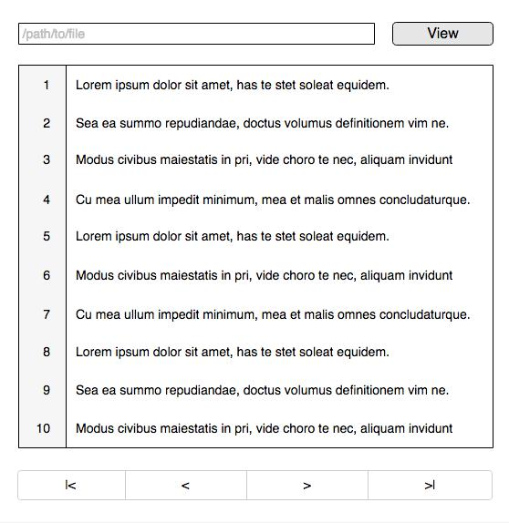

# Log File Viewer

## Task

Create web app as wireframe below that can view specific file under server log directory eg. `/var/temp/` or `C:\temp`
And display at maximum 10 lines at a time

From the wireframe
Input box is to specific the path to file under server log directory
Show the content of log file with line number in the display box
The buttons under the display box are

| Icon | Description             |
|------|-------------------------|
| l<   | Go to beginning of file |
| <    | Previous 10 lines       |
| >    | Next 10 lines           |
| >l   | Go to end of file       |

## Requirements

* Front-end can be native javascript or any javascript library but html must be valid html
* Back-end must be either PHP or NodeJs
* Web-app must be able to run by all modern-browsers
* All call-to-actions must not refresh the page
* All back-end code must have Unit Tests
* Write code as if it is production code

### Bonus points

* Consider that log file can be huge and exceed the size of memory of server and browser
* Write PHPDoc or JSDoc to document functions

## To submit your code

Archive your project with all necessary files and send email back to us within 7 days after receive the question
